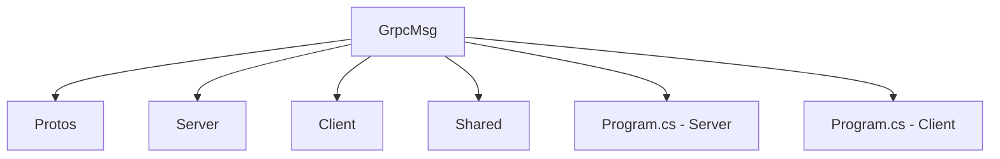

# 📘 GrpcMsg

> Projeto base que demonstra integração com gRPC em .NET, com exemplos de mensagens, serviços e comunicação entre microserviços.


---

## 📖 Visão Geral

O **GrpcMsg** tem como objetivo:

* Demonstrar como utilizar gRPC em projetos .NET para comunicação eficiente entre serviços.
* Apresentar casos práticos de mensagens, streams, contratos `.proto` e geração de código servidor/cliente.
* Servir como base para arquiteturas de microsserviços ou integrações de backend em que desempenho e design de APIs são críticos.

Ideal para desenvolvedores que desejam:

* Entender como configurar e usar gRPC em .NET;
* Migrar ou construir serviços que utilizam RPC em vez de apenas REST;
* Ter um “template” pronto para comunicação entre microsserviços.

---

## 🧩 Estrutura do Projeto



**Descrição das pastas:**

* `Protos` → Arquivos `.proto` que definem mensagens e serviços gRPC.
* `Server` → Implementação do servidor gRPC que expõe os serviços.
* `Client` → Implementação de um cliente gRPC que consome os serviços.
* `Shared` → Contratos, modelos e utilitários reutilizáveis entre servidor e cliente.

---

## 🧪 Tecnologias Utilizadas

* **.NET 8** — Plataforma moderna e performática para backend.
* **gRPC** — Framework RPC open‑source de alto desempenho via HTTP/2.
* **Protocol Buffers (.proto)** — Definição de tipos de mensagem e serviço, geração de stubs.
* **C#** — Linguagem principal de implementação.

Este projeto serve como referência para comunicação eficiente entre componentes distribuídos.

---

## ⚙️ Pré‑requisitos

Antes de executar o projeto localmente, garanta que você tenha:

* ✅ [Visual Studio 2022](https://visualstudio.microsoft.com/) ou [VS Code](https://code.visualstudio.com/)
* ✅ [.NET 8 SDK](https://dotnet.microsoft.com/download/dotnet/8.0)
* ✅ Familiaridade básica com C# e arquitetura Cliente/Servidor
* ✅ (Opcional) Conhecimento em Protocol Buffers e geração de código

---

## 🚀 Como Executar Localmente

1. Clone o repositório:

```bash
git clone https://github.com/thiagodsantana/GrpcMsg.git
cd GrpcMsg
```

2. Abra os projetos **Server** e **Client** na sua IDE.
3. Execute primeiro o **Server**, depois o **Client**.
4. Observe os logs de requisição/resposta para verificar a comunicação gRPC.
5. Explore os arquivos `.proto` na pasta `Protos` para entender os contratos de serviço e mensagem.

---

## 💡 Objetivo Educacional

Este projeto é ideal para:

* Fornecer uma base prática de estudo sobre gRPC e comunicação eficiente entre microsserviços.
* Servir como template para equipes que desejam adotar RPC em projetos .NET.
* Facilitar workshops ou treinamentos sobre arquitetura distribuída, contratos fortes e serialização eficiente.

---

## 📚 Boas Práticas e Recomendações

* Separe bem os contratos `.proto` da implementação.
* Evite transportar cargas grandes desnecessárias — gRPC + Protocol Buffers são eficientes na serialização.
* Configure **HTTP/2**, autenticação/autorização e **interceptors** adequadamente em produção.
* Monitore e registre chamadas gRPC, latência e erros — essencial em ambientes distribuídos.
* Considere fallback ou interoperabilidade com REST se necessário.

---

## 🤝 Contribuindo

1. Faça um *fork* do repositório.
2. Crie uma branch para sua feature:

```bash
git checkout -b feature/nova-funcionalidade
```

3. Adicione melhorias, como streaming, interceptors ou autenticação.
4. Faça commit das alterações:

```bash
git commit -m "Adiciona funcionalidade X ao exemplo gRPC"
```

5. Envie para o seu fork:

```bash
git push origin feature/nova-funcionalidade
```

6. Abra um Pull Request para revisão e eventual merge.

---

## 🪪 Licença

Este projeto está sob a **Licença MIT** — livre para uso, estudo e modificação.

---

## ✉️ Contato

**Autor:** [Thiago D. Santana](https://github.com/thiagodsantana)
**LinkedIn:** [linkedin.com/in/thiagodsantana](https://linkedin.com/in/thiagodsantana)
**E-mail:** [thiago.darley@gmail.com](mailto:thiago.darley@gmail.com)
